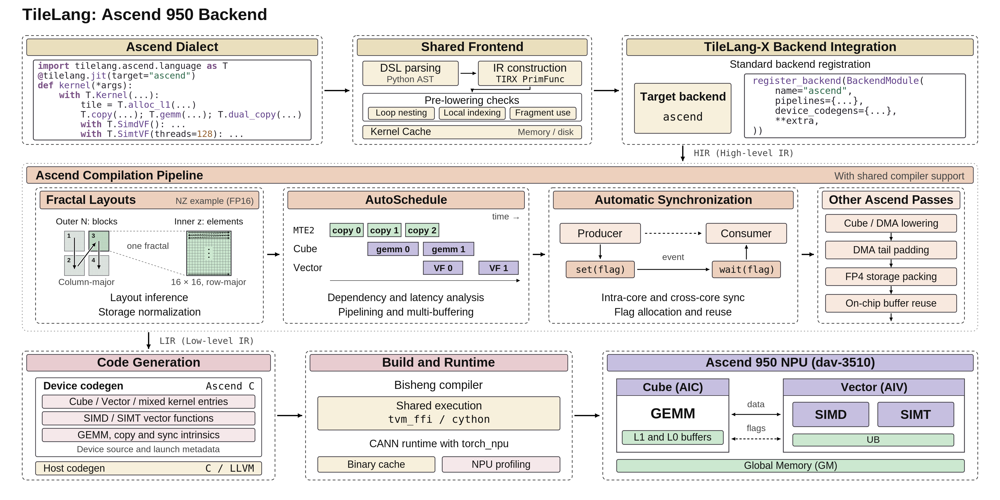
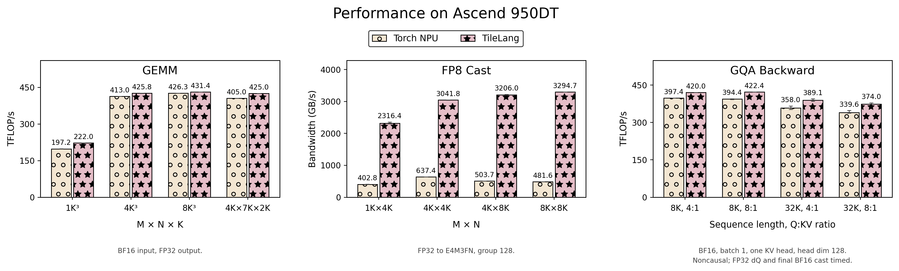

# TileLang Ascend 950 Backend

This guide shows how to install TileLang and run kernels on **Huawei Ascend
950 NPUs**. The Ascend dialect reuses TileLang's shared frontend, with Ascend-specific
lowering, scheduling, synchronization, and code generation for Cube and Vector
execution.



## Installation

### Prerequisites

To compile and run kernels, use an Ascend 950 environment with:

- A compatible Ascend driver and CANN toolkit, including `bisheng`, the
  CCE-capable `ld.lld`, and the Ascend runtime libraries.
- Compatible PyTorch and `torch_npu` installations. Verify that
  `torch.npu.is_available()` returns `True` after importing `torch_npu`.
- The Python and native build prerequisites described in the
  [installation guide](../../docs/get_started/Installation.md).

Make sure the CANN environment is configured according to the instructions
for your toolkit installation or container image before building or running
TileLang. No specific setup script or installation path is assumed.

Ensure that `bisheng` is available through `PATH` or `BISHENG_HOME/bin`, and
that the Ascend runtime libraries are discoverable by the dynamic linker.
The backend defaults to `dav-3510` for Ascend 950, so setting
`ASCEND_NPU_ARCH` is optional for this target.

### Build from Source

From the repository root:

```bash
git submodule update --init --recursive
USE_ASCEND=ON USE_CUDA=OFF python -m pip install -v .
```

Ascend is enabled by default on Linux. These settings enable Ascend and
disable CUDA, so a CUDA toolkit is not required. For an existing build
directory, pass the corresponding `-DUSE_*=...` options through `CMAKE_ARGS`
to override its cached settings.

For an editable development install:

```bash
python -m pip install -r requirements-dev.txt
USE_ASCEND=ON USE_CUDA=OFF python -m pip install -e . -v --no-build-isolation
```

## Quick Start

The following example implements the same GEMM with a fused ReLU epilogue as
the [main README](../../README.md#quick-start), while using Huawei Ascend 950
features such as SIMT vector programming and direct Cube-to-Vector data
transfers. It computes `C = relu(A @ B.T)` with `bfloat16` inputs and `float32`
accumulation and output.

`B` is stored as `[N, K]`, matching
`transpose_B=True`. All dimensions are divisible by their tile sizes; this
snippet does not handle partial tiles. Save the code as `gemm_relu.py` and
run it with `python gemm_relu.py` after installation.

```python
import torch
import torch_npu
import tilelang
import tilelang.ascend.language as T


@tilelang.jit(target="ascend")
def matmul_relu(A, B, block_M: int = 256, block_N: int = 224, block_K: int = 128):
    M, N, K = T.const("M, N, K")
    A: T.Tensor((M, K), T.bfloat16)
    B: T.Tensor((N, K), T.bfloat16)
    C = T.empty((M, N), T.float32)
    num_blocks = 32
    n_tiles = N // block_N

    with T.Kernel(num_blocks) as bx:
        A_l1 = T.alloc_l1((block_M, block_K), T.bfloat16)
        B_l1 = T.alloc_l1((block_N, block_K), T.bfloat16)
        C_l0c = T.alloc_l0c((block_M, block_N), T.float32)
        C_ub = T.alloc_shared((block_M // 2, block_N), T.float32)

        for tile in T.Persistent([M // block_M * n_tiles], num_blocks, bx):
            m, n = tile // n_tiles * block_M, tile % n_tiles * block_N
            for k in T.Pipelined(K // block_K, num_stages=2):
                T.copy(A[m, k * block_K], A_l1)
                T.copy(B[n, k * block_K], B_l1, l2_cache_ctrl="NOTALLOC_KEEP")
                T.gemm(A_l1, B_l1, C_l0c, transpose_B=True, clear_accum=(k == 0))
            T.dual_copy(C_l0c, C_ub)
            with T.SimtVF(threads=128):
                for i, j in T.Parallel(block_M // 2, block_N):
                    C_ub[i, j] = T.max(C_ub[i, j], 0)
            T.dual_copy(C_ub, C[m : m + block_M, n : n + block_N], l2_cache_ctrl="NOTALLOC_PW")

    return C


M, N, K = 256, 7168, 2048
a = torch.randn((M, K), device="npu", dtype=torch.bfloat16)
b = torch.randn((N, K), device="npu", dtype=torch.bfloat16)
c = matmul_relu(a, b)
torch.testing.assert_close(c, torch.relu(a.float() @ b.float().T), rtol=1e-2, atol=1e-2)
print("GEMM + ReLU passed.")
```

- `@tilelang.jit` specializes and compiles the kernel on first use;
  `matmul_relu(a, b)` directly returns the output tensor.
- Ascend 950 kernels typically use a persistent execution model, where a fixed
  grid of blocks iterates over work tiles. Here, `T.Persistent` distributes
  output tiles across 32 blocks, and `T.Pipelined` uses a two-stage pipeline
  for the reduction loop.
- `T.gemm` runs on the Cube cores, while `T.SimtVF` and `T.SimdVF` run on
  the Vector cores. These operations can be combined in a single
  `T.Kernel`; the compiler handles core assignment, scheduling, and
  synchronization by default. Here, `T.SimtVF` uses `T.Parallel` to
  distribute the in-place ReLU computation across threads.
- `T.dual_copy` calls move each result tile from L0C to the
  Vector cores' Unified Buffers (UB) and then to global memory. GEMM and
  ReLU run in a single kernel, without a separate launch for the epilogue.
- The L2 cache hints are chosen for the matrix sizes shown here. See the
  [DeepGEMM copy kernels](../../examples/ascend/deepgemm/kernels/copy.py)
  for cache policies in optimized matrix kernels.

## Writing Ascend Kernels

- Use the ascend dialect `tilelang.ascend.language` for Ascend-specific operations.
- Ascend supports mixing SIMT and SIMD code within a single kernel, so
  `T.Kernel(num_blocks)` specifies only the number of blocks in a
  one-dimensional grid. Use `with T.SimtVF(threads=...):` to define a SIMT
  region with its own thread count, and `T.Parallel` to distribute work
  across those threads. For SIMD programming, use `with T.SimdVF():`
  without a thread count.
- Use `T.alloc_shared` for Unified Buffer storage, `T.alloc_l1` for L1 storage,
  and `T.alloc_l0a`, `T.alloc_l0b`, or `T.alloc_l0c` for Cube buffers.

Compared with writing Ascend C directly, the default automatically scheduled
TileLang path divides the work as follows:

| Area | You write with TileLang | Ascend C code you can skip | What the compiler does |
| --- | --- | --- | --- |
| Buffering and data movement | `T.alloc_*`, `T.copy`, `T.dual_copy` | `TPipe` / `TQue` setup and DMA calls | Plans storage; lowers copies and supported layout conversions |
| Tiling and tiled operators | Shapes/dtypes, tile sizes, block count, and ops such as `T.gemm` | Low-level operator implementations | Lowers tiled ops to hardware instructions |
| SIMT computation | Scalar code and `T.Parallel` in `T.SimtVF(threads=...)` | Thread mapping and barrier placement | Maps iterations to threads; inserts barriers for detected cross-thread hazards |
| SIMD computation | Explicit `T.simd.*` operations and masks in `T.SimdVF()` | Device-function boilerplate | Lowers SIMD ops into device functions |
| Scheduling and pipelining | `T.Pipelined(...)` as needed | Manual schedules and buffer-slot rotation | Assigns tasks to AIC/AIV; schedules overlap and multibuffering |
| Synchronization | None (Just write operations in order!) | Set/wait flags and flag ID management | Infers pipeline and Cube/Vector dependencies; inserts paired flags |

Automatic scheduling handles task order and dependencies; it does not imply
automatic tensorization of arbitrary `T.Parallel` code into SIMD instructions.

## Examples

Start with the [persistent GEMM](../../examples/ascend/example_gemm.py), which
demonstrates swizzling, pipelining, precision modes and mixed-core epilogues.
For advanced GEMM tiling, L0 staging, quantization and epilogues, use
[DeepGEMM](../../examples/ascend/deepgemm). The separate
[split-K example](../../examples/ascend/example_gemm_splitk.py) demonstrates
atomic and deterministic reduction across cores.

The vector examples cover [SIMT and SIMD addition](../../examples/ascend/example_vecadd.py),
[SIMT RMSNorm](../../examples/ascend/example_rmsnorm.py),
and [SIMT and SIMD FP8 quantization](../../examples/ascend/example_per_token_cast_to_fp8.py).
[FlashAttention](../../examples/ascend/flash_attention/README.md) contains the
attention implementations.

See the [example guide](../../examples/ascend/README.md) for running and benchmarking.
Each top-level example has one matching correctness test. Small language and
compiler regressions belong in [testing/ascend](../../testing/ascend/README.md).

## Benchmark

We evaluate TileLang against Torch NPU on Ascend 950 using BF16 GEMM, FP8 casting, and GQA backward, with four shapes per operator. GEMM and GQA (compute-bound) are reported in TFLOP/s, and FP8 casting (memory bound) in effective GB/s.



## Acknowledgements

The initial version of the TileLang Ascend 950 backend was mainly developed by
[silentCoder-dev](https://github.com/silentCoder-dev),
[Elevator14B](https://github.com/Elevator14B),
[Denverjin](https://github.com/Denverjin),
[AutumnKite](https://github.com/AutumnKite),
[SiriusNEO](https://github.com/SiriusNEO),
[timetraveler314](https://github.com/timetraveler314),
[liguanglin](https://github.com/liguanglin),
[Achazwl](https://github.com/Achazwl), and
[bucket-xv](https://github.com/bucket-xv)
from [DeepSeek AI](https://github.com/deepseek-ai/). We thank [LeiWang1999](https://github.com/LeiWang1999) and the broader TileLang
community for their support in integrating the backend. We also thank the Huawei
team for their close collaboration and valuable support.
